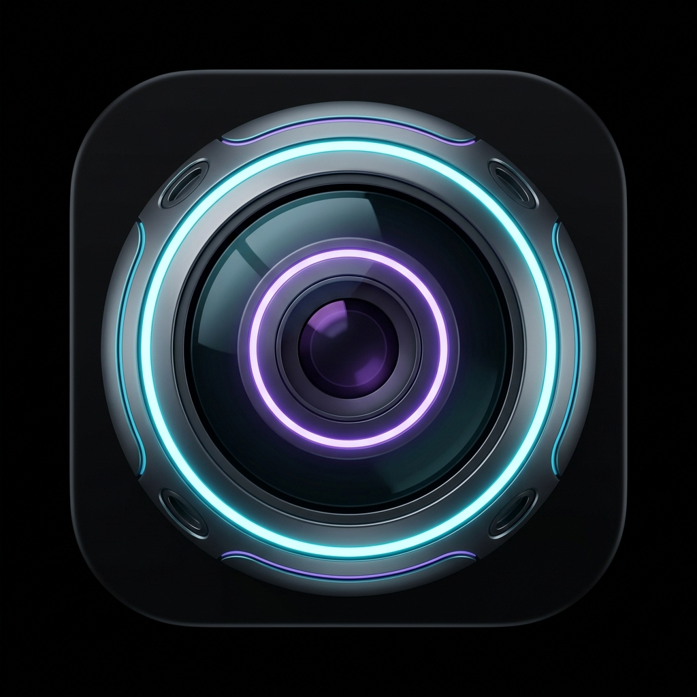
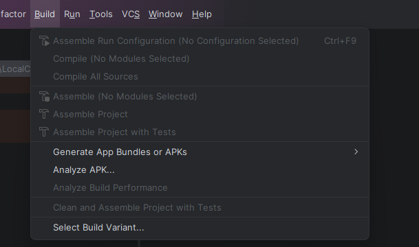

# Frigate Stream

<p align="center">
  
</p>

<p align="center">
  <b>Repurpose your old or rooted Android devices into low-latency IP cameras that push directly to Frigate NVR.</b>
</p>

<p align="center">
  
  
  
  
</p>

<p align="center">
  
</p>

---

## 📥 Direct Download (Pre-compiled APK)

You don't need to build the project yourself to get started! We have prepared a pre-compiled, release-ready ZIP file containing the Android APK.

📦 **[Download FrigateStreamer-v1.0.0.zip](release/FrigateStreamer-v1.0.0.zip)**  
*(Extract the zip to get the `.apk` file and install it directly on your device)*

---

## 🌟 Key Features

*   **Zero-Overlay Previewless Capturing**: Streams background camera feeds using Android's native `Camera2` API and off-screen virtual texture mapping. **No transparent overlay window hacks or "Display over other apps" permissions required!**
*   **Dynamic Lens Switching**: Switch between the Front and Rear camera lenses **mid-stream**. The service seamlessly rebuilds the active camera session under the hood without dropping the RTSP socket connection.
*   **Foreground Service Pipeline**: Runs as a persistent foreground service with a status notification displaying live bitrate telemetry and uptime.
*   **Boot Auto-Start**: Includes a broadcast receiver that listens for system boot (`ACTION_BOOT_COMPLETED`) and automatically triggers the background stream (can be toggled off in settings).
*   **Zero-Lag UI Cache**: Built with a reactive Jetpack Compose interface backed by a synchronized UI state cache. Your settings typing experience is fast and lag-free, while the app handles asynchronous disk writes (via Android DataStore) in the background.
*   **Battery & Performance Controls**: Selectable resolutions (480p SD, 720p HD, 1080p FHD), adjustable FPS targets (5 to 30), and custom bitrates.

---

## ⚙️ Setup & Installation

### 1. Host Server Configuration (Docker / Frigate)
Since Frigate runs inside a Docker container, you must map the go2rtc RTSP port (**`8554`**) so your phones can reach it from your local network.

Add `8554:8554` to your `docker-compose.yml` file:
```yaml
services:
  frigate:
    image: ghcr.io/blakeblackshear/frigate:stable
    ...
    ports:
      - "5000:5000"       # Web UI
      - "1984:1984"       # go2rtc API / WebRTC Dashboard
      - "8554:8554"       # RTSP (Must be mapped!)
      - "8555:8555/tcp"   # WebRTC
      - "8555:8555/udp"
```

### 2. Configure Frigate `config.yml`
Configure go2rtc to accept incoming RTSP push streams. Under `go2rtc.streams`, add empty arrays for your phone endpoints:

```yaml
go2rtc:
  streams:
    phone_ps1: []  # go2rtc awaits RTSP push from Phone 1
    phone_ps2: []  # go2rtc awaits RTSP push from Phone 2
    phone_ps3: []  # go2rtc awaits RTSP push from Phone 3

cameras:
  phone_ps2:
    ffmpeg:
      inputs:
        - path: rtsp://127.0.0.1:8554/phone_ps2
          roles:
            - detect
            - record
    detect:
      enabled: true
      width: 640
      height: 480
      fps: 5
```

### 3. Configure the Android App
1. Install the APK on your device.
2. Grant **Camera** and **Microphone** permissions.
3. Exclude the app from battery optimizations to allow uninterrupted streaming:
   *   *Go to Settings → Apps → Frigate Stream → Battery → select **Unrestricted**.*
4. Enter your home server's IP address (e.g. `192.168.31.106`) and port `8554`.
5. Name the stream (e.g. `phone_ps2` to match your Frigate config).
6. Set your lens and target resolution, then tap **START STREAM**.

---

## 🛡️ CPU & Performance Optimizations

Running continuous video decoding on a server can be CPU intensive. Follow these tips to minimize the workload:

1. **Lower the Frame Rate (FPS)**: In the app, slide the FPS limit down to **`5`** or **`10`**. Object detection works perfectly fine at 5 FPS and uses 66% less CPU than 15 FPS.
2. **Lower the Resolution**: Select **`480p SD`** (`640x480`) in the app. A 480p frame has 3 times fewer pixels to decode than 720p, reducing server overhead.
3. **Use Hardware Acceleration**: Enable hardware decoding presets (like Intel VAAPI, Nvidia NVDEC, or Raspberry Pi presets) in your Frigate `config.yml`:
   ```yaml
   ffmpeg:
     hwaccel_args: preset-vaapi
   ```

---

## 🛠️ Build Guide (For Developers)

If you wish to compile or modify the application yourself:
1. Open Android Studio (Iguana / Koala or newer).
2. Set the build variant to `debug` to ensure automated key signing.
3. Run the Gradle build task:
   ```bash
   ./gradlew assembleDebug
   ```

---

## 📜 License

This project is licensed under the MIT License - see the [LICENSE](LICENSE) file for details.
